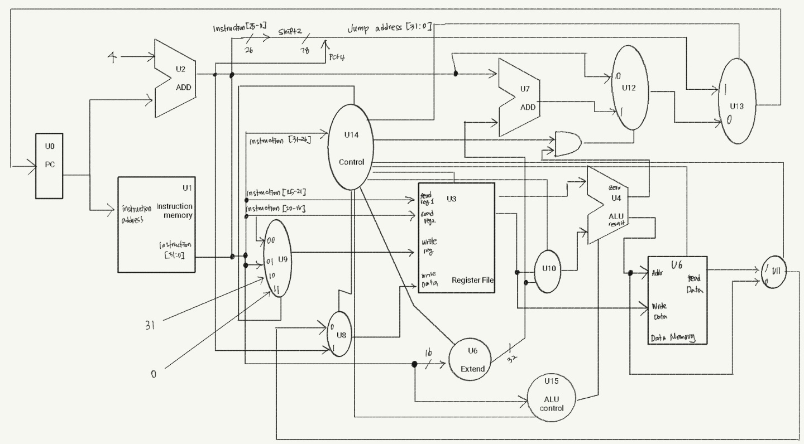

# school_3_1_CS_Single_Cycle
##### Single Cycle을 수행하는 명령어 분석, MIPS subset 간단한 구현

<프로그램 구조도>

------------------------------------

<명령어에 대한 기능과 동작>
1. SLL

| SLL | 내용 |
|---|---|
| name | SLL (Shift Left Logical) |
| role | 논리연산자 |
| type | R – Type |
| opcode/fuc | op : 000000 / funct : 000000 |
| meaning | reg[Rd] <= ( reg [Rt] << shamt ) |
| ex | sll $t1 $t0 2 |
| description | R-type instruction이기 때문에 저장은 rd에 되고, rt의 값을 shamt만큼 왼쪽으로 shift시키고 새로 생기는 자리에 0을 채워 넣는 명령어이다. 이때, rs는 사용되지 않는다는 것이 이 연산의 특징이다 |

